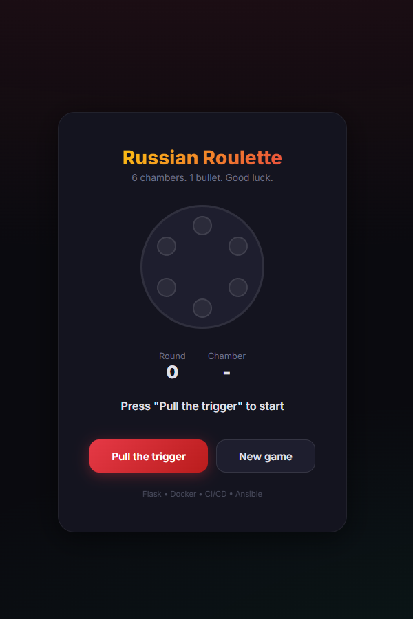

# 🎯 Russian Roulette

A sleek, modern single-page web application featuring a Russian Roulette mini-game. Built with **Flask**, containerized with **Docker**, and powered by automated **CI/CD** and **Ansible** deployment.




## 🛠️ Quick Start (Docker)

Ensure you have [Docker](https://www.docker.com/) and [Docker Compose](https://docs.docker.com/compose/) installed.

```bash
# Clone the repository
git clone https://github.com/adrmicc/russian-roulette.git
cd russian-roulette

# Start the application
docker compose up -d
```

Access the game at: `http://localhost:5000`

## 🏗️ Technical Overview

### Multi-stage Dockerfile
The `Dockerfile` uses a two-stage approach:
1. **Builder**: Installs dependencies into a virtual environment.
2. **Runtime**: Copies only the necessary files and venv, running as a non-privileged user for maximum security.

### CI/CD Pipeline
Located in `.github/workflows/ci.yml`, it automatically:
- Builds the Docker image.
- Starts a sacrificial container.
- Runs health checks and API tests (Spin, Reset).
- Verifies the frontend response.

### Ansible Deployment
Deploy to your staging/production server easily:
```bash
ansible-playbook ansible-playbook.yml
```

## 📝 API Endpoints

| Method | Endpoint | Description |
|---|---|---|
| `GET` | `/` | Serves the SPA |
| `POST` | `/api/spin` | Pull the trigger |
| `POST` | `/api/reset` | Restart the game |
| `GET` | `/health` | Service status check |

## 📜 License

This project is licensed under the MIT License - see the [LICENSE](LICENSE) file for details.
